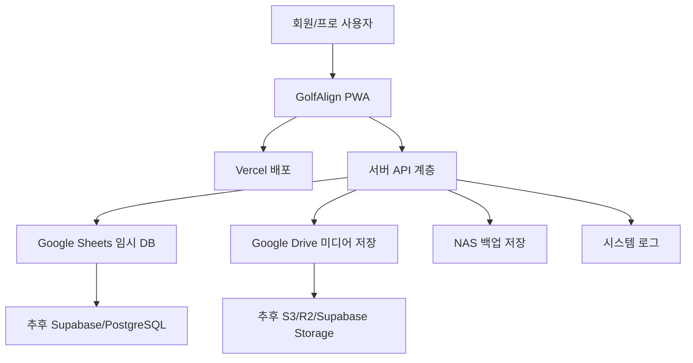
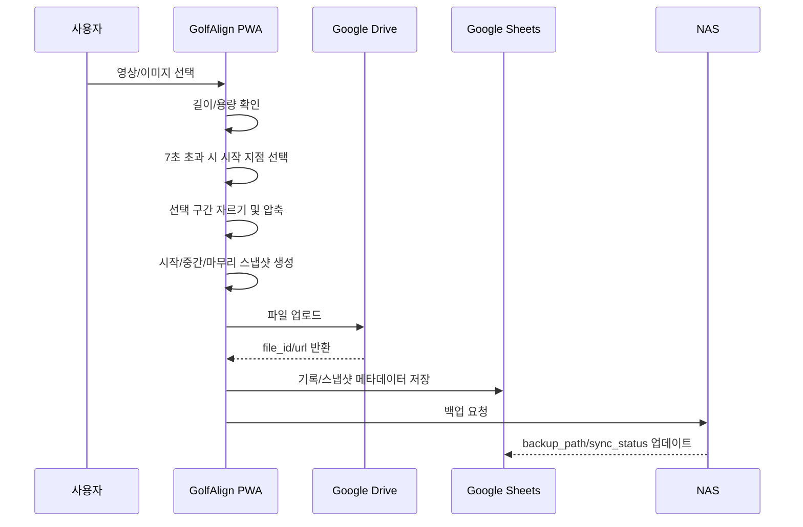

# GolfAlign 개발 스택/아키텍처 v0.4

작성일: 2026-05-14  
상태: MVP 개발 전 기준안  
목적: 비용을 최소화하면서 웹앱/PWA MVP를 만들고, 테스트 후 정식 앱/서버 구조로 확장하기 위한 개발 기준을 정리한다.

## 1. 개발 방향

GolfAlign은 처음부터 앱스토어/플레이스토어 정식 앱으로 시작하지 않는다.  
초기 MVP는 웹앱/PWA로 만들고, Vercel에 배포한 뒤 보유 도메인을 연결해 테스트한다.

초기 목표는 다음과 같다.

1. 회원이 영상/이미지를 업로드하고 기록한다.
2. 회원이 기록을 선택적으로 프로방에 공유한다.
3. 프로가 공유 기록에 피드백과 스냅샷 메모를 남긴다.
4. 프로가 훈련 과제를 보내고, 회원이 결과를 기록한다.
5. 프로방 초대 링크로 회원 가입과 방 참여를 쉽게 만든다.

커리큘럼 추천 목록은 프로와 협의 후 반영한다.  
MVP 개발 구조는 커리큘럼이 없어도 동작해야 한다.

## 2. 전체 아키텍처



MVP에서는 Google Sheets와 Google Drive를 적극 활용한다.  
다만 코드 구조는 처음부터 나중에 DB와 저장소를 교체하기 쉽게 만든다.

## 3. 프론트엔드

### 선택 스택

| 항목 | 선택 | 이유 |
|---|---|---|
| 프레임워크 | Next.js | Vercel 배포와 PWA 확장에 적합 |
| 언어 | TypeScript | 데이터 구조와 역할 분기를 안정적으로 관리 |
| UI | React 컴포넌트 | 회원/프로 화면을 재사용하기 좋음 |
| 스타일 | CSS Modules 또는 Tailwind | 초기 개발 속도와 유지보수 균형 |
| 아이콘 | lucide-react | 버튼/탭/설정 아이콘에 적합 |
| 배포 | Vercel | 이미 계정 보유, 초기 비용 최소화 |

### 화면 구성

회원 화면:

- 홈
- 내 기록
- 기록 업로드
- 기록 상세
- 훈련
- 훈련 결과 기록
- 프로방
- 초대/가입
- 더보기/설정

프로 화면:

- 프로 홈
- 레슨방 목록
- 레슨방 상세
- 회원 상세
- 피드백 작성
- 훈련 결과 확인
- 마이/설정

실제 앱에서는 회원/프로 전환 버튼을 노출하지 않는다.  
로그인 계정의 `role` 값에 따라 회원 화면 또는 프로 화면으로 자동 분기한다.

## 4. PWA 전략

MVP는 설치형 웹앱처럼 사용할 수 있게 만든다.

필수 PWA 요소:

- `manifest.json`
- 앱 아이콘
- 홈 화면 추가 가능
- 모바일 기준 반응형 UI
- 기본 오프라인 안내 화면
- HTTPS 배포

초기에는 완전한 오프라인 동기화까지 만들지 않는다.  
대신 업로드 실패/백업 실패 상태를 DB에 기록할 수 있게 한다.

PWA 앱 이름:

- name: `GolfAlign`
- short_name: `GolfAlign`
- description: `스윙을 기록하고, 성장을 정렬하다.`

## 5. 백엔드/API 계층

### MVP 방식

Next.js API Route 또는 Server Action을 사용한다.

역할:

- Google Sheets 읽기/쓰기
- Google Drive 파일 업로드/조회
- NAS 백업 요청
- 권한 확인
- 초대 링크 처리
- 피드백/훈련 결과 저장

초기에는 별도 서버를 만들지 않고 Vercel 내부 API로 시작한다.

### API 기본 구조

```text
/api/auth
/api/users
/api/rooms
/api/invites
/api/records
/api/shared-records
/api/feedback
/api/snapshots
/api/training
/api/settings
/api/storage
```

### 교체 가능한 구조

코드에서는 Google Sheets를 직접 화면에서 호출하지 않는다.  
반드시 `repository` 계층을 거친다.

예시:

```text
UI 컴포넌트
  -> service
    -> repository
      -> Google Sheets
```

나중에 PostgreSQL로 바꿀 때는 repository 구현만 교체한다.

## 6. 임시 DB: Google Sheets

MVP에서는 Google Sheets를 임시 DB로 사용한다.

장점:

- 비용이 거의 없다.
- 데이터 확인과 수정이 쉽다.
- 프로토타입 테스트에 빠르다.
- 초기 운영자가 직접 데이터를 볼 수 있다.

주의점:

- 동시성에 약하다.
- 권한 제어가 복잡하다.
- 데이터가 많아지면 느려진다.
- 정식 서비스 DB로 오래 쓰기에는 한계가 있다.

사용 기준:

- 테스트 사용자 30명 미만
- 기록 수 1,000개 미만
- 프로방 10개 미만
- 결제 기능 없음

전환 기준:

- 사용자/기록이 빠르게 늘어남
- 권한 관리가 복잡해짐
- 응답 속도 문제가 생김
- 결제/센터 관리가 필요해짐

## 7. 미디어 저장: Google Drive + NAS

### Google Drive 역할

- 영상/이미지 임시 저장
- 썸네일 저장
- 스냅샷 피드백 이미지 저장
- 프로와 회원 간 미디어 전달

### NAS 역할

- 장기 백업
- 원본/공유 파일 보관
- Google Drive 용량 절약
- 추후 자체 서버 전환 대비

### 저장 흐름



영상 정책:

- 5초 권장
- 최대 7초 허용
- 7초 초과 영상은 시작 지점을 선택하고 선택 구간만 저장
- 업로드 시 스냅샷 3장 생성
- MVP 권장 최대 크기 30MB
- 앱에서는 스냅샷/썸네일 중심으로 표시
- 원본 영상은 스트리밍하지 않고 다운로드 후 기기 재생
- 원본 장기 보관은 사용자 기기 또는 NAS 기준

저장소 필드:

- `storage_provider`
- `storage_file_id`
- `storage_url`
- `playback_policy`
- `thumbnail_file_id`
- `snapshot_count`
- `backup_provider`
- `backup_path`
- `sync_status`

## 8. NAS 연동 방식

MVP 기준 NAS 정보:

- 모델: ipTIME NAS1 Dual
- 내부 IP: `192.168.0.102`
- 외부 접속 주소: `https://novart.ipdisk.co.kr`
- 사용 목적: Google Drive 임시 저장 이후 장기 백업/아카이브
- 운영 원칙: NAS 연결 실패가 앱 사용을 막지 않도록 비동기 백업으로 처리한다.

초기에는 NAS를 직접 실시간 서버처럼 쓰지 않는다.  
NAS는 백업 저장소로 먼저 사용한다.

추천 순서:

1. Google Drive 업로드 성공
2. Google Sheets에 기록 저장
3. 백업 대상 큐에 추가
4. NAS 백업 스크립트가 주기적으로 다운로드/저장
5. 백업 완료 후 `backup_path`, `sync_status` 업데이트

초기 NAS 백업 방식:

- 로컬 PC 또는 NAS에서 주기 실행 스크립트
- Google Drive 폴더 동기화
- 파일명은 `record_id` 기준
- Sheets 백업도 정기 저장

나중에 가능해지는 방식:

- NAS WebDAV
- NAS SFTP
- NAS API
- 자체 백엔드 서버

MVP에서는 NAS 연결 실패가 앱 사용을 막으면 안 된다.  
NAS 백업은 비동기 후처리로 둔다.

### 영상 원본 아카이브 기준

MVP에서는 영상 원본을 앱 서버에서 계속 들고 있지 않는다. Google Drive/임시 저장소는 전달과 다운로드용으로 사용하고, NAS는 장기 보관소로 사용한다.

- 기본 정책: `MEDIA_ARCHIVE_POLICY=feedback_done_plus_7_or_upload_plus_14`
- 피드백 완료 후 7일이 지나면 NAS 이동 대상으로 잡는다.
- 피드백이 완료되지 않아도 업로드 후 14일이 지나면 NAS 이동 후보로 잡는다.
- 이미지 기록은 `archive_policy=none`으로 두고 썸네일/스냅샷 중심으로 관리한다.
- NAS 이동 성공 전에는 원본을 삭제하지 않는다.
- NAS 이동 성공 시 `backup_provider=nas`, `backup_path`, `sync_status=backed_up`, `archived_at`을 갱신한다.
- NAS 이동 실패 시 `sync_status=failed`로 남기고 관리자 지표에서 확인한다.

## 9. 인증/로그인

프로토타입:

- 아이디
- 비밀번호
- 가입 유형: 일반 회원 / 프로

MVP 초기:

- 이메일/비밀번호 또는 간단 로그인
- `role` 기반 화면 분기
- 초대 링크 가입 흐름

정식 전환 시 검토:

- Google 로그인
- Apple 로그인
- Kakao 로그인
- 휴대폰 인증
- 프로 인증 절차

역할 값:

| role | 의미 |
|---|---|
| member | 일반 회원 |
| pro | 프로 |
| admin | 관리자 |

프로 인증은 MVP에서 수동 검수로 시작할 수 있다.

## 10. 권한 구조

기본 규칙:

- 회원은 자기 기록만 본다.
- 프로는 회원이 공유한 기록만 본다.
- 프로방 회원 목록은 이름/프로필 이미지만 공개한다.
- 공통 드릴은 방 회원에게 공개 가능하다.
- 공통 드릴 결과는 회원 본인과 프로만 본다.
- 개인 과제와 개인 결과는 비공개다.

권한 확인은 API 계층에서 처리한다.  
화면에서 숨기는 것만으로 권한 처리를 끝내지 않는다.

## 11. 언어 설정

MVP 지원:

- 한국어
- 영어

언어 결정 순서:

1. 사용자가 직접 선택한 언어
2. 계정의 `preferred_language`
3. 브라우저/기기 언어
4. 서비스 기본값

한국 MVP 기본값은 한국어다.  
글로벌 배포 전에는 앱 배포 지역, 앱스토어 설명 언어, 프로 피드백 번역 정책을 다시 검토한다.

## 12. AI/분석 엔진

MVP에서는 정밀 AI 분석을 핵심 의존성으로 두지 않는다.  
처음에는 영상/이미지 기록, 프로 피드백, 스냅샷 메모가 핵심이다.

초기 가능 기능:

- 영상/이미지 업로드
- 스냅샷 선택
- 라인/각도/메모 표시
- Before & After 비교
- 프로 피드백 누적

추후 분석 엔진 후보:

- MediaPipe Pose
- TensorFlow.js
- OpenCV.js
- 서버 기반 Python/OpenCV
- Gemini 기반 텍스트/이미지 보조 분석

분석 데이터 원칙:

- 1차: 웹 정보/기본 지식 기반
- 2차: 실제 프로 판단 데이터
- 둘 다 주기적으로 검증하고 축적한다.

MVP에서는 자동 교정 결론을 강하게 말하지 않는다.  
프로 피드백을 중심에 두고, AI는 보조 역할로 둔다.

## 13. 폴더 구조 제안

```text
GolfAlign/
  app/
    member/
    pro/
    api/
  components/
    ui/
    layout/
    records/
    training/
    feedback/
    rooms/
  lib/
    auth/
    repositories/
    services/
    storage/
    validators/
  data/
    mock/
  docs/
    planning/
    db/
    architecture/
  prototype/
    html/
  assets/
    logo/
    icons/
  scripts/
    google-sheets/
    google-drive/
    nas-backup/
```

현재 작업 폴더에서는 다음 단계에서 문서와 HTML을 이 구조에 맞춰 정리한다.

## 14. 환경 변수

나중에 필요한 환경 변수 예시:

```text
NEXT_PUBLIC_APP_URL=
GOOGLE_CLIENT_EMAIL=
GOOGLE_PRIVATE_KEY=
GOOGLE_SHEETS_SPREADSHEET_ID=
GOOGLE_DRIVE_ROOT_FOLDER_ID=
NAS_BACKUP_ENABLED=
NAS_BACKUP_BASE_PATH=
ADMIN_USER_IDS=
```

환경 변수와 키 파일은 Git에 올리지 않는다.

## 15. 로컬 개발 환경

필수:

- Node.js LTS
- npm
- Git
- VS Code 또는 Cursor

권장:

- Chrome
- Vercel 계정
- Google Cloud 프로젝트
- Google Sheets API
- Google Drive API

로컬 실행 예시:

```bash
npm install
npm run dev
```

초기 HTML 프로토타입 확인은 별도 서버 없이 파일로 열 수 있다.  
Next.js 전환 후에는 로컬 서버가 필요하다.

## 16. 배포 전략

1단계:

- 로컬 HTML 프로토타입
- 파일 공유

2단계:

- Next.js PWA 개발
- Vercel Preview 배포

3단계:

- 보유 도메인 연결
- 소수 회원/프로 테스트

4단계:

- Google Sheets/Drive 운영 한계 확인
- Supabase/PostgreSQL 전환 검토

5단계:

- 앱스토어/플레이스토어 출시 검토

Apple Developer, Google Play Console은 정식 앱 출시 전까지 미룬다.

## 17. 비용 최소화 전략

이미 보유/사용 중:

- Vercel 계정
- 도메인
- Gemini
- Codex Pro
- NAS 8TB

초기 비용을 줄이는 방법:

- PWA로 시작
- Google Sheets 임시 DB
- Google Drive 임시 미디어 저장
- NAS 백업
- 결제/앱스토어 출시 보류
- AI 고도화 보류
- 프로 수동 피드백 중심

초기 유료 전환 후보:

- 도메인 DNS/메일 설정
- Google Drive 용량 부족 시 추가 용량
- Supabase 또는 클라우드 DB
- S3/R2 등 미디어 저장소
- 앱스토어 등록비

## 18. MVP 개발 순서

추천 순서:

1. 프로젝트 폴더 정리
2. README 작성
3. Next.js/PWA 기본 구조 정리
4. 공통 UI 컴포넌트 제작
5. 회원 화면 구현
6. 프로 화면 구현
7. mock 데이터 연결
8. Google Sheets 연동
9. Google Drive 업로드 연동
10. 초대 링크 흐름 구현
11. 피드백/스냅샷 메모 구현
12. 훈련 결과 기록 구현
13. Vercel 배포
14. 소수 테스트

## 19. MVP에서 하지 않을 것

- 복잡한 AI 자동 분석
- 3D 모델/리깅 모델
- 결제
- 센터 관리자
- 라운드 모집 실제 기능
- 전체 커뮤니티
- 앱스토어/플레이스토어 출시
- 고급 통계 대시보드

## 20. 다음 작업

다음 단계는 프로젝트 폴더 구조 정리다.

할 일:

- `docs/` 생성
- 기획 문서 이동
- DB 문서 이동
- 아키텍처 문서 이동
- HTML 프로토타입 이동
- 로고 assets 정리
- README 작성 준비
